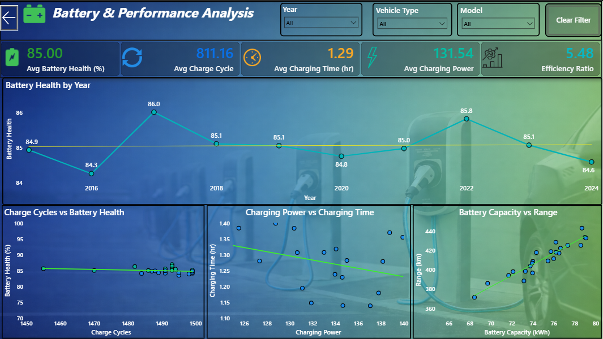

# ⚡ EV Fleet Performance Dashboard

## 📌 Project Overview

The EV Fleet Performance Dashboard is an interactive business intelligence solution developed using Microsoft Power BI to monitor, analyze, and optimize the performance of electric vehicle (EV) fleets.

This project converts raw operational data into meaningful insights that help fleet managers track battery performance, charging efficiency, operational costs, vehicle utilization, and environmental impact — all in one centralized dashboard.

---

## 🎯 Business Problem

Managing an electric vehicle fleet involves multiple challenges:

- Monitoring battery health degradation
- Managing charging time and energy consumption
- Controlling maintenance and operational costs
- Improving vehicle utilization
- Tracking CO₂ emission reduction

Without proper data analysis, fleet managers may face increased downtime, high battery replacement costs, and inefficient resource usage.

This dashboard provides a structured and visual solution to overcome these challenges.

---

## 🎯 Project Objectives

- Monitor EV battery performance and health
- Analyze charging efficiency and energy usage
- Track maintenance and operational costs
- Improve fleet utilization
- Measure environmental sustainability impact
- Enable data-driven decision making

---

## 📊 Dashboard Features

### 🔋 Battery Performance Analysis
- Battery Capacity (kWh)
- Battery Health (%)
- Charge Cycles
- Vehicle Range (km)

### ⚡ Charging Insights
- Charging Power (kW)
- Charging Time (hours)
- Energy Consumption (kWh/100km)
- Region-wise charging trends

### 🚗 Fleet Utilization
- Total Mileage
- Average Speed
- Usage Type (Commercial / Private)
- Region-wise performance

### 💰 Cost Analysis
- Maintenance Cost
- Insurance Cost
- Total Operational Cost
- Cost per Kilometer

### 🌱 Sustainability Metrics
- CO₂ Emissions Saved (tons)
- Energy efficiency trends
- Environmental impact tracking

---

## 📌 Key KPIs

- Total Vehicles
- Total Distance Covered
- Average Battery Health %
- Total Maintenance Cost
- Total Charging Cost
- Vehicle Utilization Rate
- CO₂ Saved (tons)

---

## 🛠 Tools & Technologies Used

- Microsoft Power BI
- DAX (Data Analysis Expressions)
- Power Query
- Excel / CSV Dataset

---

## 📂 Dataset Columns

- Vehicle ID
- Make & Model
- Year
- Region
- Vehicle Type
- Battery Capacity (kWh)
- Battery Health (%)
- Range (km)
- Charging Power (kW)
- Charging Time (hr)
- Charge Cycles
- Energy Consumption (kWh/100km)
- Mileage (km)
- Maintenance Cost (USD)
- CO₂ Saved (tons)

---

## 🚀 Business Impact

- Improved EV fleet efficiency
- Reduced operational and maintenance costs
- Early detection of battery degradation
- Optimized charging strategies
- Enhanced sustainability tracking
- Better strategic decision-making

---

## 📷 Dashboard Preview

  
  

  
  

---

## 👤 Author

Vipul Alsundkar  

